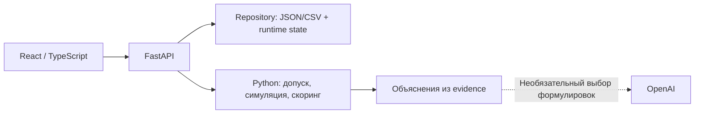

# Career Quest

**Персональный навигатор карьерного развития сотрудников**

HackAlem AI · кейс Halyk Bank · трек Management

Career Quest связывает обучение с конкретной карьерной целью. Сотрудник видит,
каких навыков ему не хватает для целевой роли и грейда, получает до трёх следующих
активностей с объяснением выбора и наблюдает изменение прогресса после завершения.
HR получает общую картину дефицитов и участия, а также может загрузить новые данные.

**Рабочая версия — в `main`.** Проект запускается локально без отдельного сервера
БД и без OpenAI-ключа. Ниже — запуск, сценарий проверки и описание алгоритма.

## Какую задачу решаем

Каталог курсов сам по себе не объясняет сотруднику, что проходить дальше и зачем.
Career Quest учитывает требования карьерной цели, критичность навыков, прошлое
участие, эффект обучения, затраты времени и доступность мероприятий.

Например, самый низкий навык может быть Public Speaking, но активность по System
Design может оказаться полезнее: она закрывает важные требования цели сразу по
нескольким навыкам. Проверить причины выбора можно прямо в карточке рекомендации.

| Для сотрудника | Для HR |
|---|---|
| Профиль и текущие эффективные навыки | Каталог сотрудников и просмотр профилей |
| Текущая позиция → целевая роль и грейд | Общие дефициты навыков текущих ролей |
| Покрытие требований цели — career readiness | Участие и статусы активностей |
| Top 1–3 активности, ожидаемый эффект и объяснение | Полнота рассчитанных рекомендаций |
| Завершение активности и обновление прогресса | Проверка и импорт данных жюри |

## Быстрый запуск демо — два терминала

Нужны **Python 3.11+**, **Node.js 22.12+** с npm и Git.
Команды предназначены для macOS, Linux или WSL. При первой установке зависимостей
нужен интернет; отдельная установка pnpm не требуется.

Если репозиторий ещё не скачан:

```bash
git clone --branch main https://github.com/BAITC-Hacks/hack-7b100a71-garden.git
cd hack-7b100a71-garden
```

**Терминал 1 — из корня репозитория:**

```bash
CAREER_QUEST_AUTH_DISABLED=true OPENAI_API_KEY= ./run.sh
```

Скрипт создаст `.venv`, установит Python-зависимости и запустит backend.
Оставьте терминал открытым. Проверка: [health](http://127.0.0.1:8000/health)
возвращает `status: ok`; [Swagger](http://127.0.0.1:8000/docs) описывает API.

**Терминал 2 — из того же корня репозитория:**

```bash
cd frontend
npx --yes pnpm@11.25.0 install --frozen-lockfile
VITE_API_MODE=real VITE_API_BASE_URL=http://127.0.0.1:8000 npx --yes pnpm@11.25.0 dev --port 5173 --strictPort
```

Откройте **[http://127.0.0.1:5173](http://127.0.0.1:5173)**.
Frontend работает с настоящим FastAPI, а не с mock-данными.

| Поле входа | Сотрудник | HR |
|---|---|---|
| Workspace | `Employee` | `HR` |
| Employee ID | `E0001` | Не требуется |
| Access token | `demo-local` | `demo-local` |

Нажмите **Open workspace**. Для переключения используйте **Change identity**.
После перезагрузки вкладки вход потребуется повторить.

В этом quickstart серверная авторизация **явно отключена только для локального
показа синтетического датасета**. `demo-local` — непустая строка для формы, не
секрет и не токен защищённого режима. Настоящее разграничение доступа описано ниже.
Пустой `OPENAI_API_KEY` включает детерминированные объяснения без внешнего LLM.
Оба сервера останавливаются через `Ctrl+C`.

## Что проверить жюри за 3–5 минут

Начальные значения относятся к исходному датасету, без сохранённых demo-completion.

| Шаг | Действие | Ожидаемый результат |
|---|---|---|
| 1 | Открыть E0001 | Backend Engineer → Middle; readiness **58.97%**, EV_005 — первая рекомендация |
| 2 | Раскрыть **Why this?**, затем **Score, factors and evidence** | Объяснение на казахском, факторы оценки, исходные доказательства и симуляция навыков |
| 3 | Нажать **Complete activity** у EV_005 | API Design **2 → 3**, System Design **1 → 2**, readiness **66.67%**; EV_005 исчезает, EV_036 остаётся |
| 4 | Через HR открыть E0004 и завершить EV_026 | Переход в Product Manager / Middle, допуск `target_role`; readiness **42.11% → 52.63%** |
| 5 | Открыть E0006 и E0018 | Корректные состояния «нет следующего грейда» и «нет подходящих активностей» |
| 6 | Открыть **HR overview** | Общие дефициты, участие, полнота рекомендаций и форма загрузки данных |

Completion возвращает подтверждение backend, сохраняет изменение и обновляет
профиль, историю и рекомендации. Повтор запроса с тем же ключом действия не
начисляет прирост повторно.

**Для повторного чистого показа** остановите backend и используйте отдельный файл:

```bash
CAREER_QUEST_AUTH_DISABLED=true OPENAI_API_KEY= CAREER_QUEST_STATE_PATH=".runtime/demo-$(date +%Y%m%d-%H%M%S).json" ./run.sh
```

Предыдущий `.runtime/state.json` останется целым. Для продолжения того же показа
после restart укажите тот же созданный путь, а не новый файл с другой датой.

## Как выбираются рекомендации

Решение принимает детерминированный Python-движок. При одинаковых входных данных,
конфигурации и расчётной дате результат воспроизводим.

1. **Карьерная цель.** Используется явный `career_goal`, включая переход в другую
   роль. Без цели выбирается следующий грейд текущей роли. Для Lead без цели
   не придумывается более высокий грейд.
2. **Текущие навыки.** К оценке на `last_review_date` применяются последующие
   завершения с учётом `gain`, `max_level` и хронологии, без двойного начисления.
   Неоднозначная историческая реконструкция помечается как оценочная.
3. **Дефициты.** Эффективные навыки сравниваются с `required_skills` целевой роли
   и грейда; отдельно выделяются `critical_skills`.
4. **Допуск.** Проверяются аудитория, достигнутый грейд, prerequisites, расписание,
   история завершений и полезный прирост. Обязательные мероприятия не рекомендуются.
   Для явного перехода разрешена аудитория целевой роли, но грейд допуска остаётся
   текущим. Это основание возвращается в evidence.
5. **Симуляция и оценка.** Для всех допустимых активностей рассчитываются навыки
   и дефициты до/после, readiness и семь факторов скоринга.
6. **Top 1–3 и объяснение.** Возвращаются готовый порядок, оценки, ожидаемый эффект
   и проверяемые причины выбора. Если подходящих мероприятий нет, объясняется это
   состояние, а не создаётся фиктивная рекомендация.

| Фактор | Вес | Что учитывает |
|---|---:|---|
| Влияние на критические навыки | 35% | Сокращение критических дефицитов цели |
| Сокращение дефицитов | 25% | Общий полезный прирост относительно требований цели |
| Соответствие карьерной цели | 15% | Доля прироста, полезного для цели, среди всех фактических улучшений |
| Совместимость с историей | 10% | Исходы участия в похожих активностях с учётом давности |
| Обратная связь и результаты | 5% | Сглаженные рейтинги и оценки обучения |
| Эффективность по времени | 5% | Полезный прирост на час активности |
| Доступность | 5% | Ожидание ближайшей сессии или формат self-paced |

Итоговая оценка — сумма взвешенных нормализованных факторов. Влияние на критические
навыки, сокращение дефицитов и эффективность нормализуются по **всему допустимому
пулу до выбора Top 3**. В API остаются и нормализованные значения, и исходные
доказательства. Негативная история снижает совместимость, но не создаёт вечного
запрета. Самостоятельное участие и назначения manager/HR имеют разные веса.

Все коэффициенты централизованы в
[`backend/recommendation/config.py`](backend/recommendation/config.py).

### Что означает readiness

Это покрытие требований целевой роли и грейда:

```text
readiness = Σ(w × min(текущий уровень, требуемый уровень))
            / Σ(w × требуемый уровень)

w = 2 для критического навыка цели, иначе 1
```

Значение отображается в процентах. Навык выше требования не компенсирует чужой
дефицит. Readiness не является вероятностью или гарантией повышения. При отсутствии
цели или положительных требований числовое значение не выдумывается.

## Роль AI и защита от выдуманных фактов

Детерминированные объяснения доступны на **казахском, русском и английском** по
`preferred_language` сотрудника. Они используют цель, симуляцию, историю и evidence
уже выбранных рекомендаций.

OpenAI — необязательный слой выбора формулировок: модель выбирает разрешённые
варианты `direct`/`coaching` для установленных фактов. Итоговый текст собирается
локально из проверенных шаблонов. Произвольный текст и новые факты не принимаются.
Модель не может выбрать, отфильтровать, пересортировать или переоценить активности.

При отсутствии ключа, таймауте, ошибке API или неподдерживаемом ответе автоматически
сохраняются детерминированные объяснения. Для включения OpenAI задайте собственный
`OPENAI_API_KEY` в окружении backend или его локальном `.env` и уберите
`OPENAI_API_KEY=` из команды запуска. Ключ не включается в frontend или Git.
[Подробный контракт объяснений](docs/explanations-contract.md).

## Данные жюри и новые профили

В репозитории находится официальный датасет: **200 сотрудников, 60 навыков,
8 ролей × 4 грейда, 40 мероприятий и 2743 записи истории**. Расчётная дата —
**2026-10-01**, заданная метаданными. Runtime completion хранит реальное время
операции отдельно от логического дня демо.

Движок работает по входным профилям и каталогу; ID E0001/E0004 используются в
сценариях проверки, а не как условия выбора рекомендаций.

Для проверки новых данных войдите как HR и откройте **HR overview → Validate &
upload dataset**. Сохраняйте структуру официального JSON/CSV, включая JSON `meta`.

| Режим | Что загрузить | Результат |
|---|---|---|
| `append` | Новые employees и/или activity history | Добавление в текущий набор; существующие ID не перезаписываются |
| `replace` | Все четыре файла: employees, skills, events, activity history | Полная замена рабочего набора и сброс прежних runtime receipts |

Нажмите **Validate files**, проверьте ошибки и итоговые counts, затем подтвердите
upload. Импорт применяется атомарно: невалидные файлы не меняют состояние.
После успешной загрузки обновляется версия данных, новые сотрудники доступны HR
в selector, рекомендации рассчитываются по обновлённому набору. В защищённом
режиме employee-токен нового сотрудника настраивается на backend отдельно.

[Схема и правила официального датасета](data/career_quest_dataset/README.md) ·
[HTTP-контракт для импорта и остальных экранов](docs/FRONTEND_API_CONTRACT.md).

## Архитектура и хранение



| Часть | Реализация |
|---|---|
| Интерфейс | React, TypeScript, Vite, TanStack Query |
| HTTP API и валидация | FastAPI, Pydantic |
| Рекомендации | Независимые Python-функции в `backend/recommendation/` |
| Объяснения | Изолированный слой `backend/ai/` |
| Исходные данные | Неизменённые JSON/CSV в `data/career_quest_dataset/` |
| Сохранённое состояние | `.runtime/state.json` по умолчанию |

Используется **персистентное файловое хранилище**: отдельные PostgreSQL/SQLite,
Redis, Docker и миграции для запуска не нужны. Completion, импортированный набор,
порядок операций, версии и idempotency receipts сохраняются атомарной заменой
файла и восстанавливаются после перезапуска. Исходный датасет не переписывается.

Backend работает **одним worker**. На hosting файл состояния должен находиться на
записываемом постоянном диске/volume. Пустой `CAREER_QUEST_STATE_PATH` включает
режим только в памяти. Остальная конфигурация — в [`.env.example`](.env.example).

HR-дефициты считаются относительно **текущей** роли и грейда, readiness — относительно
**цели**. HR coverage может быть частичным: UI показывает, для скольких сотрудников
этой версии уже вычислены рекомендации. Неоценённые профили не выдаются за нулевой
результат. Публичного рейтинга сотрудников нет.

## Проверка разграничения доступа

Для защищённого режима задайте собственные токены в корневом `.env`:

```dotenv
CAREER_QUEST_AUTH_DISABLED=false
HR_API_TOKEN=your-own-hr-token
EMPLOYEE_TOKENS_JSON={"your-own-e0001-token":"E0001","your-own-e0004-token":"E0004"}
```

Замените `your-own-…` своими значениями. Запустите
`CAREER_QUEST_AUTH_DISABLED=false ./run.sh`. HR входит с `HR_API_TOKEN`, employee —
со своим ID и соответствующим токеном. Сервер независимо проверяет права:
сотрудник получает только собственные данные, HR — каталог, аналитику и импорт.
Выбор Workspace не расширяет права. На frontend токены находятся только в памяти вкладки.

## Что проверено

| Проверка | Результат |
|---|---:|
| Recommendation + AI tests | 280 passed |
| Backend tests | 102 passed |
| Backend/engine integration tests | 43 passed |
| Полный совместный Python-прогон | **425 passed** |
| Frontend unit/component/adapter tests | **120 passed** |
| Frontend build / TypeScript / lint | Passed |
| SHA-256 официального датасета | Без изменений |

Отдельно выполнена настоящая браузерная проверка Vite + FastAPI: E0001/E0004 с
completion и обновлением прогресса, E0006/E0018, HR, append нового профиля и
четырёхфайловый replace. Проверены persistence/restart и отсутствие двойного
начисления. Браузерные проверки отделены от unit/API-тестов в
[отчёте интеграции](docs/integration-phase2-audit.md).

Повторить автоматические проверки из корня репозитория:

```bash
.venv/bin/python -m pip install -r requirements-dev.txt
PYTHONDONTWRITEBYTECODE=1 .venv/bin/python -m pytest -q -p no:cacheprovider
cd frontend
npx --yes pnpm@11.25.0 test
npx --yes pnpm@11.25.0 build
npx --yes pnpm@11.25.0 lint
```

Команда `build` включает TypeScript-проверку. Дополнительно:
[результаты browser/HTTP](docs/integration-phase2-results.json) ·
[подробный алгоритм](docs/recommendation-contract.md) ·
[инструкция frontend](frontend/README.md).

## Границы MVP и устранение проблем

- Интерфейс преимущественно английский; объяснения поддерживают kk/ru/en.
- Вход использует заранее настроенные токены, без корпоративного SSO.
- Траектория показывает текущую позицию и цель; многошаговый план всей карьеры не строится.
- Live OpenAI-вызов не входит в подтверждённую проверку; fallback и обработка ошибок покрыты тестами.
- Quickstart предназначен для локального запуска, публичный hosting не настроен.

| Проблема | Что проверить |
|---|---|
| Порт 8000/5173 занят | Остановить предыдущий сервер; `--strictPort` предотвращает незаметный переход на другой порт |
| Backend unavailable | Терминал backend, `/health`, адрес API и CORS |
| 401/403 | Режим авторизации и токен; `demo-local` работает только при отключённой серверной авторизации |
| Уже улучшенные навыки у E0001 | Сохранён предыдущий completion; использовать отдельный state-файл для чистого показа |
| Датасет не найден | Проверить четыре файла в `data/career_quest_dataset/` или `CAREER_QUEST_DATA_DIR` |

## Команда

| Участник | Ответственность |
|---|---|
| Zhanibek | Recommendation engine, scoring, readiness, объяснения/OpenAI, финальная интеграция |
| Bekarys | FastAPI, валидация/загрузка данных, API, persistence, HR и импорт |
| Adilet | React frontend, employee/career/recommendation UI, HR и upload UI |
